### Author: Kelvin Carvalho Bomfim

## Seleção Voxar: Projeto de Machine Learning utilizando Modelo YOLO 
* Revisão do funcionamento de modelos YOLO, hiperparâmetros, optimização, loss function, taxa de aprendizagem.
* Implementação do modelo YOLOv5 pré treinado com o dataset COCO128.
* Treinamento e teste de modelos customizados a partir de diferentes datasets. 
* Pré-Processamento dos dados com o RoboFlow. 
* Análise do treinamento em tempo real com WandB. 

## Código e recursos utilizados 
**Python Version:** 3.9  
**Libs:** pandas, numpy, matplotlib, pyTorch(CPU to train/GPU to predict), OpenCV                                                          
**COCO128:** https://www.kaggle.com/datasets/ultralytics/coco128                                                         
**BCCD:** https://github.com/Shenggan/BCCD_Dataset                                                         
**Snail Custom Dataset:** /SnailDataset                                                       
**LabelImg:** https://github.com/tzutalin/labelImg                                                       
**RoboFlow:** https://roboflow.com/                                                       
**WandB:** https://https://wandb.ai/                                                       

## Módulo Básico: 1
O modelo escolhido para o case, foi o YOLOv5 pré-treinado no dataset COCO128, uma versão reduzida do COCO Dataset, o mesmo mostrou-se de fácil manipulação e bem intuitivo, o teste foi feito nas imagens pré disponíveis do mesmo:

```python
import torch
from matplotlib import pyplot as plt
import numpy as np
import cv2
```

```python
model = torch.hub.load('ultralytics/yolov5', 'yolov5s') #Modelo pré-treinado com o COCO128
```

```python
img = "Voxar/yolov5/data/images/bus.jpg"
results = model(img)
results.print()
```


```
image 1/1: 1080x810 4 persons, 1 bus #Resultado da reconhecimento de objetos na imagem
Speed: 518.7ms pre-process, 303.5ms inference, 435.0ms NMS per image at shape (1, 3, 640, 480)
```

## Módulo Básico: 2
O backgroud por trás dos modelos YOLO se dá através da subdivisão de uma imagem em N pedaços, formando um grid SxS = N, cada um desses n pedaços é responsavel pela detecção e localização de objetos no seu conteúdo. Como a detecção e reconhecimento acontecem simultaneamente para cada N pedaço, o consumo de poder computacional é reduzido, mas em consequência, ocorre um aumento no numero de predições duplicadas (Ex: um objeto estar subdivido entre mais de um N pedaço), este problema é contornado através do uso de Non Maximal Suppression (IoU), dessa forma conseguindo reduzir o numero de predições duplicadas sem utilizar valores máximo globais como parâmetro.

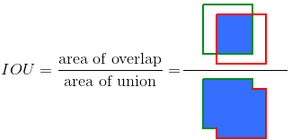

Arquivo de hiperparametros:
```python
# YOLOv5 🚀 by Ultralytics, GPL-3.0 license
# Hyperparameters for medium-augmentation COCO training from scratch
# python train.py --batch 32 --cfg yolov5m6.yaml --weights '' --data coco.yaml --img 1280 --epochs 300
# See tutorials for hyperparameter evolution https://github.com/ultralytics/yolov5#tutorials

lr0: 0.01  # initial learning rate (SGD=1E-2, Adam=1E-3)
lrf: 0.1  # final OneCycleLR learning rate (lr0 * lrf)
momentum: 0.937  # SGD momentum/Adam beta1
weight_decay: 0.0005  # optimizer weight decay 5e-4
warmup_epochs: 3.0  # warmup epochs (fractions ok)
warmup_momentum: 0.8  # warmup initial momentum
warmup_bias_lr: 0.1  # warmup initial bias lr
box: 0.05  # box loss gain
cls: 0.3  # cls loss gain
cls_pw: 1.0  # cls BCELoss positive_weight
obj: 0.7  # obj loss gain (scale with pixels)
obj_pw: 1.0  # obj BCELoss positive_weight
iou_t: 0.20  # IoU training threshold
anchor_t: 4.0  # anchor-multiple threshold
# anchors: 3  # anchors per output layer (0 to ignore)
fl_gamma: 0.0  # focal loss gamma (efficientDet default gamma=1.5)
hsv_h: 0.015  # image HSV-Hue augmentation (fraction)
hsv_s: 0.7  # image HSV-Saturation augmentation (fraction)
hsv_v: 0.4  # image HSV-Value augmentation (fraction)
degrees: 0.0  # image rotation (+/- deg)
translate: 0.1  # image translation (+/- fraction)
scale: 0.9  # image scale (+/- gain)
shear: 0.0  # image shear (+/- deg)
perspective: 0.0  # image perspective (+/- fraction), range 0-0.001
flipud: 0.0  # image flip up-down (probability)
fliplr: 0.5  # image flip left-right (probability)
mosaic: 1.0  # image mosaic (probability)
mixup: 0.1  # image mixup (probability)
copy_paste: 0.0  # segment copy-paste (probability)
```

Cada predição feita com o YOLO, retorna um vetor Nx1 de pelo menos N = 6, do qual contém primeiro a predição da existência de um objeto geral, as coordenadas do centro da bounding box do objeto e suas dimensões X e Y, e para cada classe existente no modelo, contém uma variavel que indica sua existência na imagem:

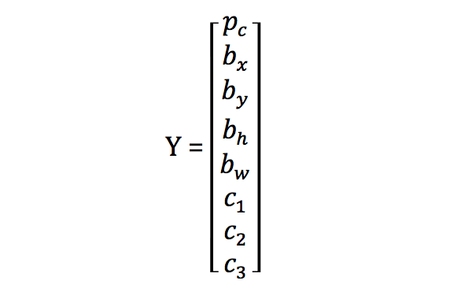

## Módulo Básico: 3
Implementação do modelo:

```python
model = torch.hub.load('ultralytics/yolov5', 'yolov5s') #Cria instância do modelo a partir de modelo pré treinado pela ultralytics
```


```python
img = "/yolov5/data/images/zidane.jpg"
results = model(img)
results.print()
```

```
image 1/1: 720x1280 2 persons, 2 ties
Speed: 79.9ms pre-process, 298.7ms inference, 15.2ms NMS per image at shape (1, 3, 384, 640)
```

```python
%matplotlib inline 
plt.imshow(np.squeeze(results.render()))
plt.show()
```

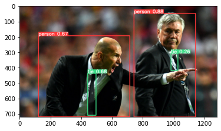

## Módulo Básico: 4
Implementação do modelo para parâmetros de teste alterados:
Para este módulo já foi utilizado um dataset custom, que será abordado mais a fundo nos próximos passos.

Treino Vanilla:
--img 320 --batch 8 --epochs 40 
IoU Threshold = 0.2

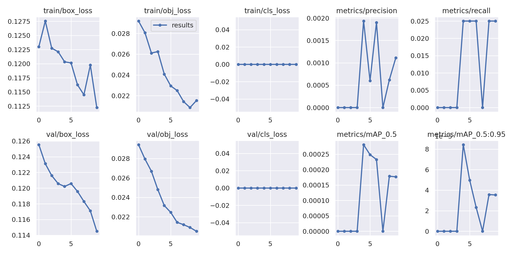

Treino Vanilla:
--img 640 --batch 8 --epochs 40 
IoU Threshold = 0.5

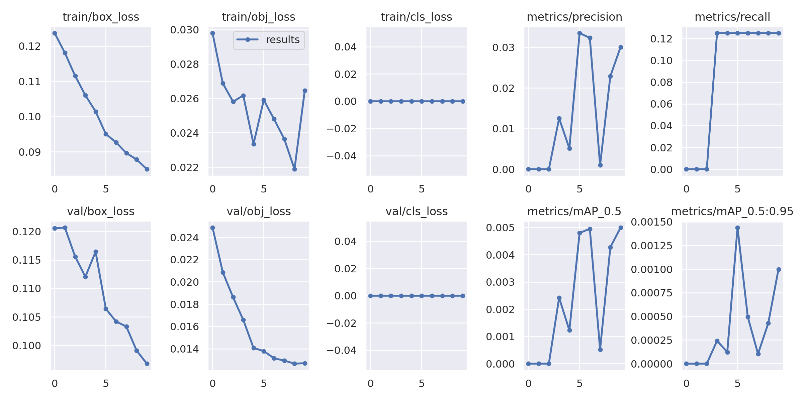

Podemos perceber que ao aumentar a resolução de entrada das imagens e o limite de IoU, a predição se tornou um pouco melhor, mesmo assim podemos dizer que este modelo não é capaz de reconhecer e localizar os objetos com facilidade.

## Módulo Especifico: TREINAMENTO DETECÇÃO 2D
* Snail Dataset:
Para a realização deste módulo, foi criado um dataset personalizado chamado de Snail Dataset, contendo 40 frames retirados de diferentes episódios do cartoon americano "Hora de Aventura", frames esses que contém pequenos "easter eggs" de uma lesma.
O dataset foi subdivido para 28 imagens de treinamento, 8 imagens de validação e 4 imagens de teste.
A rotulação de cada um dos frames foi feito através da ferramenta LabelImg, onde cada lesma foi selecionada e rotulada manualmente.

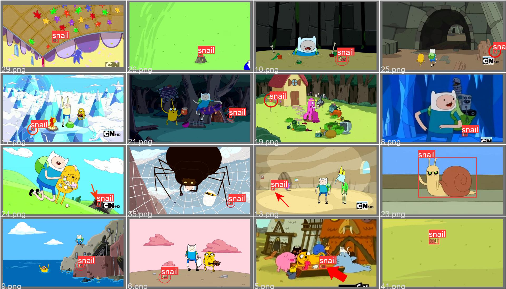

```python
model = torch.hub.load('ultralytics/yolov5', 'custom', path='\snail.pt', force_reload=True) #Gera o modelo a partir dos dados de treinamento com o Dataset Snail
```

```python
img = "/yolov5/data/images/snailtest.jpg"
results = model(img)
results.print()
```

```python
%matplotlib inline 
plt.imshow(np.squeeze(results.render()))
plt.show()
```

```python
image 1/1: 640x616 (no detections)
Speed: 317.6ms pre-process, 76.4ms inference, 3.0ms NMS per image at shape (1, 3, 640, 640)
```

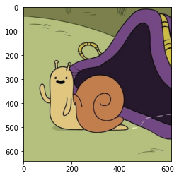


* BCCD YOLO Dataset:
Com o fracasso do treinamento do Snail Dataset, o foco da detecção foi alterado para o âmbito biológico, então o novo dataset a ser utilizado foi o bccD (Blood Cell Counting & Detection), contendo 360 imagens no total (240 de treino, 60 de validação e 60 de teste), compreendendo 3 classes de objetos: White Blood Cells, Red Blood Cells e Platelets

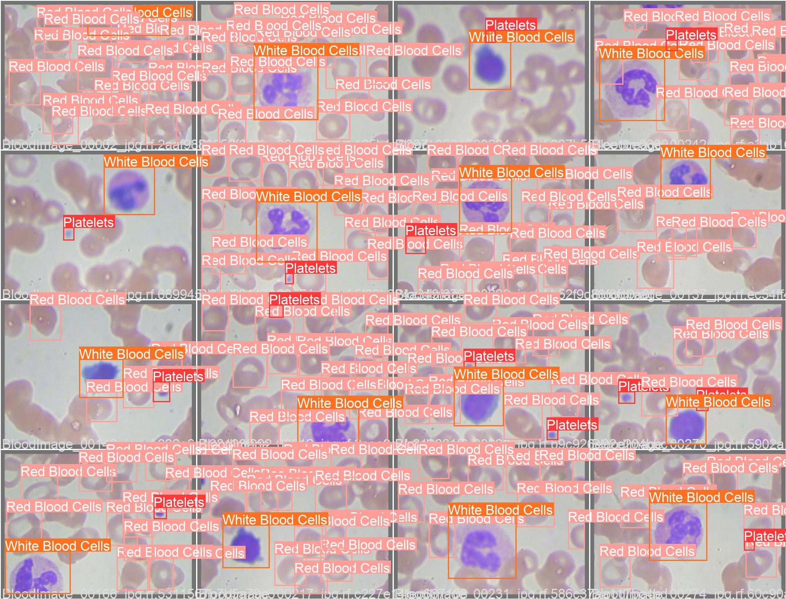

```python
model = torch.hub.load('ultralytics/yolov5', 'custom', path='\bccd.pt', force_reload=True) #Gera o modelo a partir dos dados de treinamento com o Dataset BCCD
```

```python
img = "/yolov5/data/images/bccdtest.jpg"
results = model(img)
results.print()
```

```python
%matplotlib inline 
plt.imshow(np.squeeze(results.render()))
plt.show()
```

```python
image 1/1: 480x640 1 Platelets, 21 Red Blood Cellss, 1 White Blood Cells
Speed: 14.0ms pre-process, 173.5ms inference, 7.0ms NMS per image at shape (1, 3, 480, 640)
```

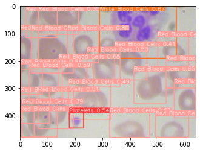

## Módulo Especifico: Pré-Processamento
Após a implementação e treinamento "vanilla" do modelo, foram utilizados diversos métodos para tentar aumentar acurácia das detecções, para tal utilizou-se da ferramenta Roboflow para gerar novos dados através de Data Augmentation.
O processo se dá quando criam-se novas imagens que podem ser utilizadas para treinamento e/ou validação, através de distorções das imagens já existentes, esse processo além de aumentar a quantidade de dados, aumenta também os graus de liberdade de posição no qual o modelo é capaz de reconhecer as classes.

* Snail Dataset:
Inicio: 28 de treino, 8 de validação e 4 de teste
Depois de aplicar Data Augmentation:  84 de treino, 8 de validação e 4 de teste
Pré Processamento: Auto-Orient + Stretch to 416x416
Data Augmentation: Flip: Horizontal, Vertical + 90° Rotate: Clockwise, Counter-Clockwise, Upside Down + Crop: 0% Minimum Zoom, 43% Maximum Zoom + Saturation: Between -67% and +67% + Mosaic + Bounding Box: Flip: Horizontal, Vertical

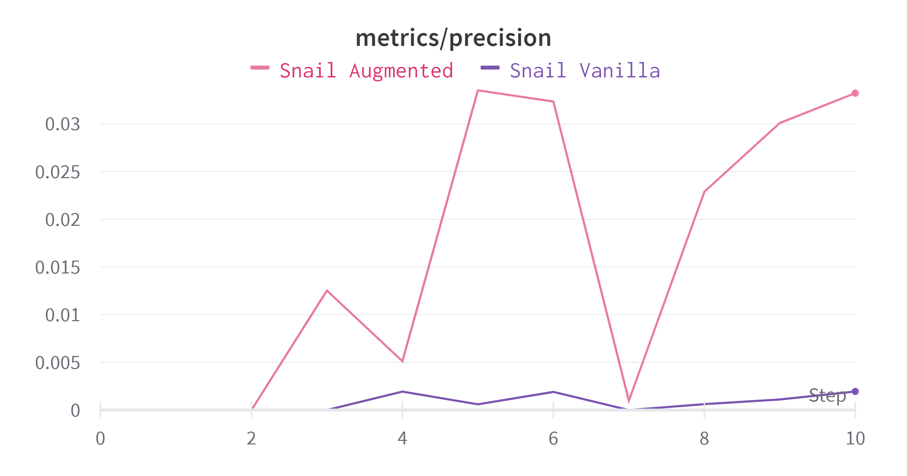

* BCCD Dataset:
Inicio: 240 de treino, 60 de validação e 60 de teste
Depois de aplicar Data Augmentation: 720 de treino, 60 de validação e 60 de teste
Pré Processamento: Auto-Orient
Data Augmentation: Flip: Horizontal, Vertical + 90° Rotate: Clockwise, Counter-Clockwise + Rotation: Between -30° and +30° + Shear: ±15° Horizontal, ±15° Vertical

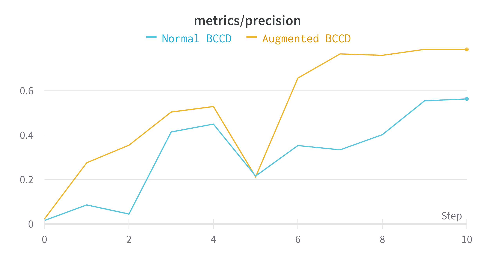

## Módulo Especifico: Fine Tuning
Para o acompanhamento em tempo real do treinamento de cada um dos modelos, foi utilizada a ferramenta WandB, ferramenta que permite acompanhar a evolução de métricas enquanto o modelo ainda segue em treinamento, a partir dela podemos também comparar diferentes resultados de diferentes treinamentos e datasets.


## Performance do Modelo
BCCD Vanilla:
*	**Precision** : 0.56264
*	**box_loss**: 0.04872
*	**cls_loss**: 0.00785
*	**obj_loss**: 0.14802

BCCD Augmented:
*	**Precision** : 0.78559
*	**box_loss**: 0.03540
*	**cls_loss**: 0.00268
*	**obj_loss**: 0.14197

Snail Dataset Vanilla:
*	**Precision** : 0.00194
*	**box_loss**: 0.11223
*	**cls_loss**: 0
*	**obj_loss**: 0.02152

Snail Dataset Augmented:
*	**Precision** : 0.03351
*	**box_loss**: 0.08506
*	**cls_loss**: 0
*	**obj_loss**: 0.02645

## Conclusão 
O algoritmo YOLO se mostra ser de fácil implementação e manipulação, sendo capaz de reconhecer e localizar diferentes classes de objetos em uma imagem com ligeira facilidade e pouco poder de processamento, apesar de ter dificuldade em reconhecer objetos pequenos em imagens "desenhos 2d", apresenta sim uma boa precisão e confiabilidade em predições. 


